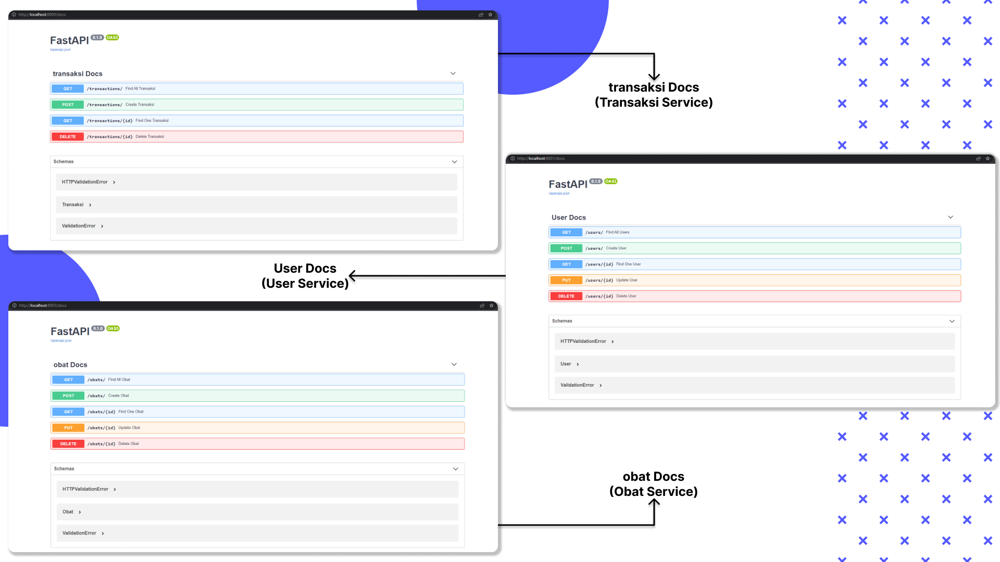

# TOKO OBAT API

## REST API Webapp

Aplikasi ini merupakan aplikasi API yang dibangun menggunakan FastAPI dan dengan database MongoDB, yang dimana di deploy dengan menggunakan docker.

Aplikasi ini hanyalah aplikasi API CRUD (Create, Read, Update, Delete / Destroy) yang dibuat untuk dapat mendukung penerapan arsitektur microservices, dimana terdapat 3 services pada aplikasi ini, yaitu:

    1. Obat Service
    2. User Service
    3. Transaksi Service

### Yang digunakan pada project ini

-   [FastAPI](https://fastapi.tiangolo.com/)
-   [MongoDB](https://www.mongodb.com/)
-   [Docker](https://www.docker.com/)

### Cara Menjalankan Aplikasi

1. Clone repository ini dengan menjalankan command `git clone https://github.com/Boreneoux/tkObat.git`
2. Jalankan command `docker-compose up -d --build`
3. Ubah IP Database dengan IP lokal anda pada masing-masing `db.py` disemua service (Obat,User,Transaksi)
4. Buka aplikasi pada browser anda di url `localhost:8000/docs` untuk Service Transaksi. `localhost:8001/docs` untuk Service User dan `localhost:8002/docs` untuk Service Obat.

#### Preview

